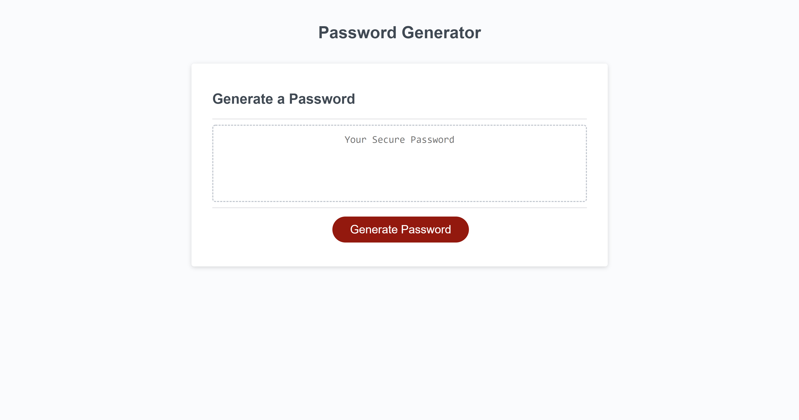
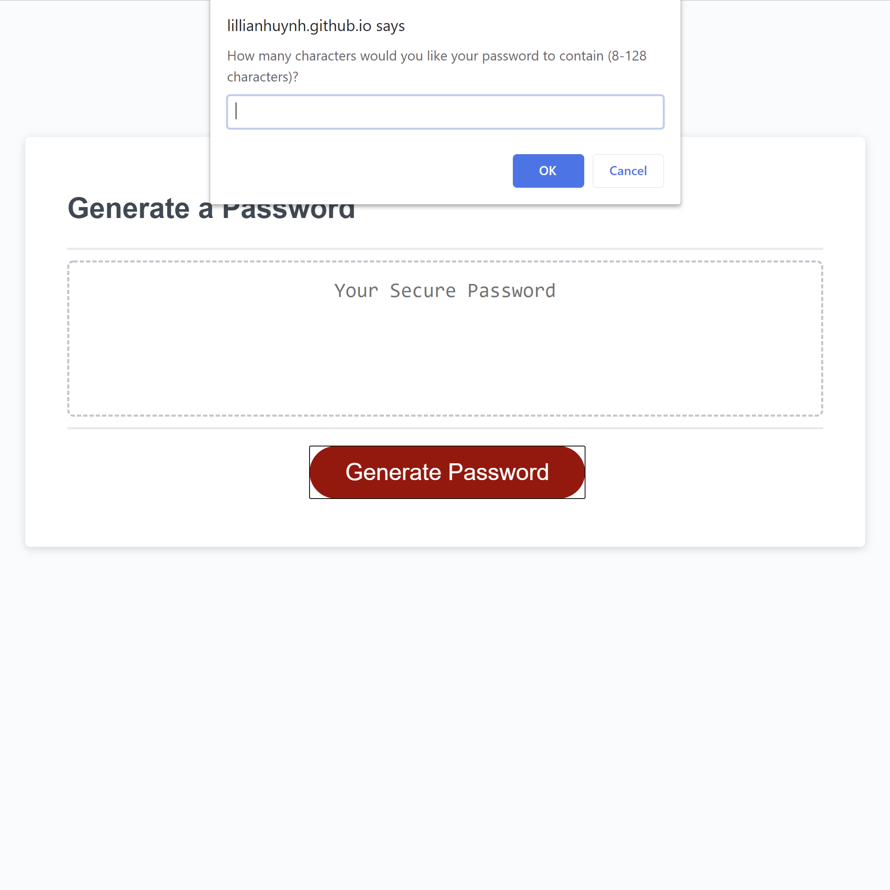
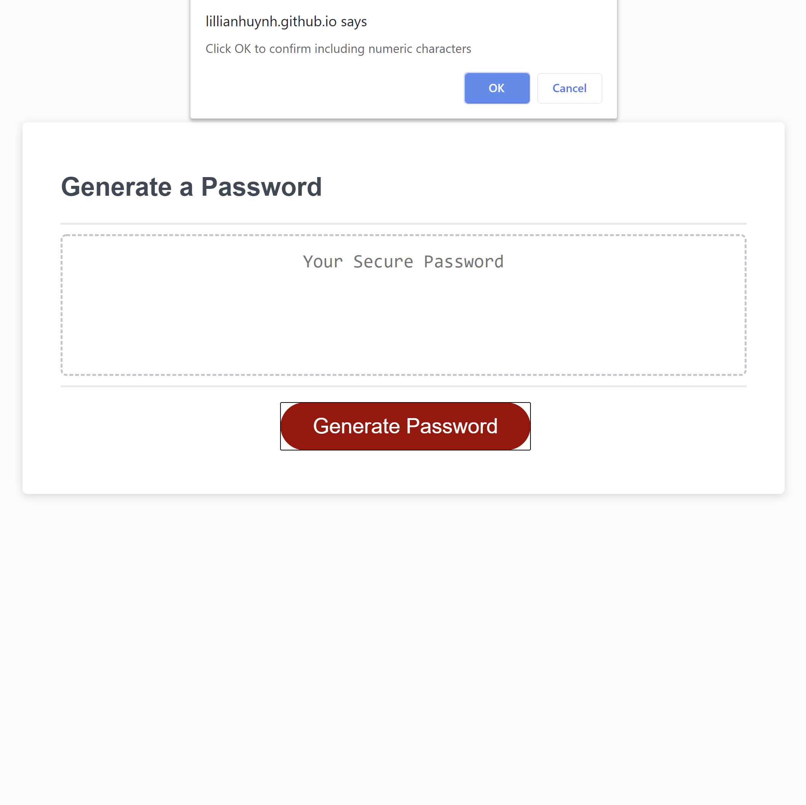
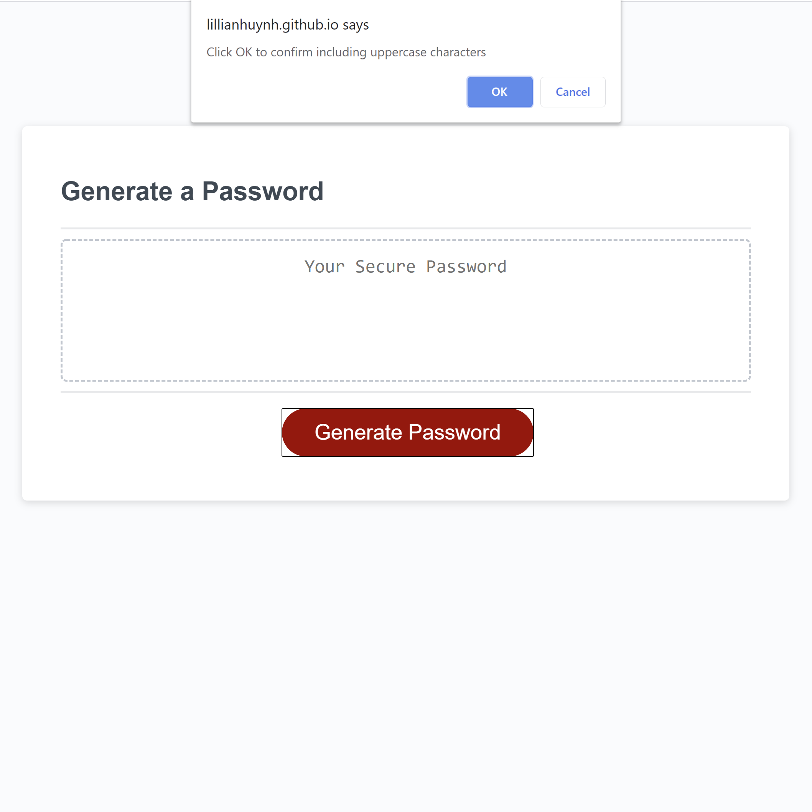

# Password_Generator

Project link: [https://github.com/lillianhuynh/Password_Generator]

Github-page: [https://lillianhuynh.github.io/Password_Generator/]

## Table of Contents

* [About the Project](#about-the-project)
  * [Built With](#built-with)
* [Getting Started](#getting-started)
  * [Installation](#installation)
* [Usage](#usage)
* [Roadmap](#roadmap)
* [Contributing](#contributing)
* [License](#license)
* [Contact](#contact)

## About The Project


"Password_Generator" was built to generate a secured random password based on user-selected criteria. User can choose password length from 8 to 128 characters. User can aslo choose to include desired character types such as lowercase, uppercase, numeric, and/or special characters.


## Getting Started

To get a local copy up and running follow these simple steps.

### Installation

1. Clone the repo
```sh
git clone https://github.com/lillianhuynh/My-Portfolio-template
```

## Usage

Repeatedly using the same passwords or using 'weak' passwords can leave you vulnerable to hackers. This application will help you to generate a secured and strong password to protect sensitive accounts that hold your confidential, personal data. 

You can start by clicking 'Generate Password' button, and answer some promted questions to include your desired character types.

| Length     | Special Characters|
|------------|------------|
|  |  |

| Numeric    | Lowercase         |
|------------|------------|
|  |  |

| Uppercase  | 
|------------|
|  | 

## Roadmap

See the [open issues](https://github.com/lillianhuynh/Password_Generator/issues) for a list of proposed features (and known issues).

## Contributing

Contributions are what make the open source community such an amazing place to be learn, inspire, and create. Any contributions you make are **greatly appreciated**.

1. Fork the Project
2. Create your Feature Branch (`git checkout -b feature/AmazingFeature`)
3. Commit your Changes (`git commit -m 'Add some AmazingFeature'`)
4. Push to the Branch (`git push origin feature/AmazingFeature`)
5. Open a Pull Request

## License

N/A

## Contact

Lili Huynh- lillianhuynh312@gmail.com
Project link: [https://github.com/lillianhuynh/Password_Generator]


